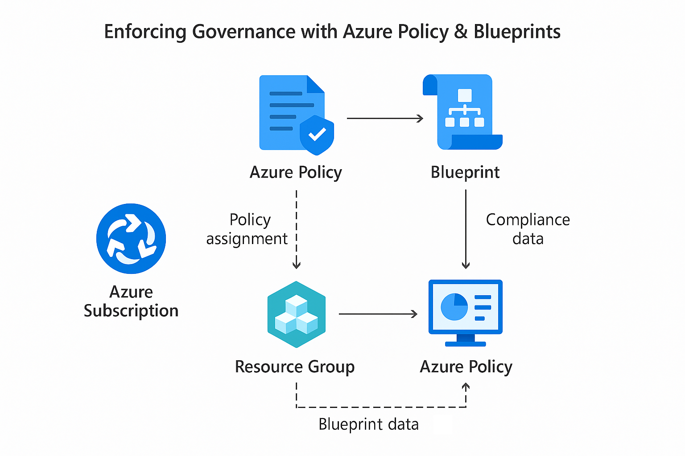

## Azure Governance with Azure Policy & Blueprints Lab

As part of my hands-on Azure cloud security portfolio, this lab demonstrates the enforcement of cloud governance using **Azure Policy** and **Blueprints**.  
It automates security controls, prevents configuration drift and validates compliance posture at scale.

---

## Table of Contents

- [Overview](#overview)
- [Real-World Risk](#real-world-risk)
- [What I Built](#what-i-built)
- [Diagram](#diagram)
- [Objectives](#objectives)
- [Steps Performed](#steps-performed)
  - [1. Resource Group Setup]  
  - [2. Custom Policy Definition]  
  - [3. Policy Assignment] 
  - [4. Manual Enforcement Testing]
  - [5. Compliance Dashboard Validation]
  - [6. Azure Blueprint Creation]
  - [7. Blueprint Assignment]
  - [8. Post-Blueprint Enforcement Test]
  - [9. Compliance Confirmation] 
  - [10. Cleanup]
- [Screenshots](#screenshots)
- [Lessons Learned](#lessons-learned)
- [Notes and Considerations](#notes-and-considerations)
- [References](#references)
- [Contact](#contact)

---

## Overview

This lab demonstrates automated enforcement of governance and compliance in Azure environments using **Azure Policy** and **Blueprints**.

I authored and assigned policies to:
- Prevent public IP exposure.
- Enforce tagging conventions.

I then bundled these policies into an **Azure Blueprint** with a predefined resource group and deployed it to test governance-as-code in action.

---

## Real-World Risk

- Cloud misconfigurations (e.g., public IPs, missing tags) are a top cause of breaches.
- Manual reviews don’t scale—organizations need automation.
- Compliance-as-code is essential for repeatable, auditable environments.

---

## What I Built

- Created a **custom Azure Policy** to block public IP creation.
- Assigned a **built-in tag policy** to enforce the `Environment` tag on all resources.
- Packaged these into a reusable **Azure Blueprint** with an embedded resource group.
- Assigned the blueprint to a subscription, deploying governance automatically.
- Verified enforcement by triggering and capturing **policy denial errors**.
- Tracked compliance results via the **Azure Policy dashboard**.

---

## Diagram

---

## Objectives

- Prevent non-compliant infrastructure via policy-as-code.  
- Automate resource governance using blueprints.
- Demonstrate enforcement through blocked deployments.  
- Prove compliance visibility through Azure dashboards.  

---

## Steps Performed

**1. Resource Group Setup**  
   - Created `rg-policy-lab` to test early policy assignments.  
   - Confirmed its creation before applying scope-level enforcement *(Screenshot: resource-group-created.png)*

**2. Custom Policy Definition**  
   - Authored a JSON policy (`Deny-Public-IP`) to block creation of public IP addresses.  
   - Used Azure CLI to create the custom policy definition *(Screenshot: custom-policy-definition.png)*

**3. Policy Assignment (Custom & Built-in)**  
   - Assigned `Deny-Public-IP` to `rg-policy-lab` scope.  
   - Assigned built-in policy `Require a tag on resources` with parameter `Environment`*(Screenshots: policy-assignment-basics.png, policy-assignment-review.png, tag-policy-assignment-basics.png, tag-policy-parameters.png & tag-policy-review.png)*

**4. Manual Enforcement Testing**  
   - Attempted to create:
     - Public IP in `rg-policy-lab` → Denied (proves Deny-Public-IP works)  
     - Storage Account without `Environment` tag → Denied (proves tag policy works)*(Screenshots: policy-enforcement-public-ip-error.png & tag-policy-enforcement-error.png)*

**5. Compliance Dashboard Validation**  
   - Used Policy > Compliance to track enforcement results.  
   - Scoped to `rg-policy-lab` and confirmed policy effect *(Screenshot: compliance-dashboard-updated.png)*

**6. Azure Blueprint Creation**  
   - Created blueprint `secure-rg-blueprint` with:
     - Resource Group: `rg-secured-env`.
     - Deny-Public-IP policy.
     - Require Environment tag policy *(Screenshots: blueprint-basics.png & blueprint-artifact-list.png)*

**7. Blueprint Assignment**  
   - Published version `v1.0` of the blueprint.  
   - Assigned the blueprint to the subscription with:
     - Tag: `Environment`.
     - Location: `East US` *(Screenshots: blueprint-assignment-parameters.png & blueprint-published-overview.png)*

**8. Post-Blueprint Enforcement Test**  
   - Attempted to deploy:
     - Public IP in `rg-secured-env` → Denied by blueprint-assigned policy.  
     - Untagged Storage Account in `rg-secured-env` → Denied *(Screenshots: policy-denial-public-ip.png & policy-denial-storage-no-tag.png)*

**9. Compliance Confirmation (Blueprint Scope)**  
   - Scoped the Compliance Dashboard to `rg-secured-env`.  
   - Verified that blueprint-assigned policies were active and compliant *(Screenshot: blueprint-compliance-status.png)*

**10. Cleanup**  
   - Confirmed deployment of `rg-secured-env` via Blueprint.  
   - Deleted `rg-policy-lab` if no longer needed.  
   - Retained blueprint and assignment for demonstration purposes.  

---

## Screenshots

*All screenshots are included in the screenshots/ folder.*

| Step | Filename                               | Description                                        |
|------|----------------------------------------|----------------------------------------------------|
| 1    | resource-group-created.png             | Initial policy lab resource group                  |
| 2    | custom-policy-definition.png           | JSON editor with Deny-Public-IP policy             |
| 3    | policy-assignment-basics.png           | Custom policy assignment scope and name            |
| 3    | policy-assignment-review.png           | Review screen for Deny-Public-IP assignment        |
| 3    | tag-policy-assignment-basics.png       | Built-in tag policy assignment setup               |
| 3    | tag-policy-parameters.png              | Parameter screen for `Environment` tag             |
| 3    | tag-policy-review.png                  | Review screen for tag policy                       |
| 4    | policy-enforcement-public-ip-error.png | Manual test: denied public IP deployment           |
| 4    | tag-policy-enforcement-error.png       | Manual test: denied untagged storage resource      |
| 5    | compliance-dashboard-updated.png       | Compliance dashboard scoped to `rg-policy-lab`     |
| 6    | blueprint-basics.png                   | Blueprint metadata definition                      |
| 6    | blueprint-artifact-list.png            | Artifact list: resource group + policies           |
| 7    | blueprint-assignment-parameters.png    | Assignment parameters for blueprint                |
| 7    | blueprint-published-overview.png       | Published blueprint with all artifacts             |
| 8    | policy-denial-public-ip.png            | Enforcement test: denied public IP in blueprint RG |
| 8    | policy-denial-storage-no-tag.png       | Enforcement test: denied untagged storage in RG    |
| 9    | blueprint-compliance-status.png        | Compliance scope filtered to `rg-secured-env`      |
 
---

## Lessons Learned

- Governance must be **automated** to scale securely in the cloud.
- Custom + built-in policies are powerful when combined.
- Blueprints provide **reusable governance bundles** with defined scopes.
- Testing policy effects (denials) proves enforcement, not just intent.

---

## Notes and Considerations

- Azure Blueprints are being deprecated July 2026 → migrate to **Template Specs** in the future.
- Policy compliance state may take 5–15 minutes to update after deployment.
- "Not started" status means no matching resource exists yet.

---

## References

- [Azure Policy](https://learn.microsoft.com/en-us/azure/governance/policy/overview)
- [Azure Blueprints](https://learn.microsoft.com/en-us/azure/governance/blueprints/overview)
- [Template Specs (Blueprint Replacement)](https://learn.microsoft.com/en-us/azure/azure-resource-manager/templates/template-specs)
- [Azure Resource Manager Templates](https://learn.microsoft.com/en-us/azure/azure-resource-manager/templates/overview)

---

## Contact

Sebastian Silva C. – July, 2025 – Berlin, Germany.  
[LinkedIn](https://www.linkedin.com/in/sebastiansilc) | [GitHub](https://github.com/SebaSilC) | [sebastian@playbookvisualarts.com](mailto:sebastian@playbookvisualarts.com)
